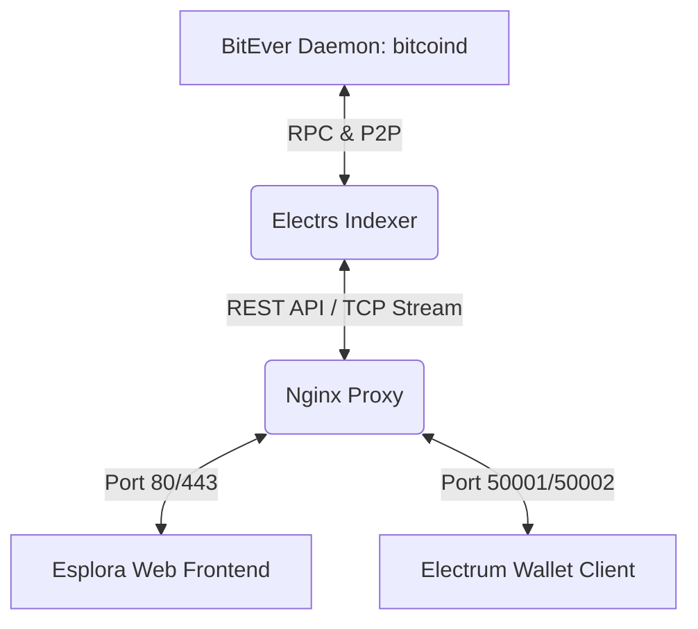

# BitEver Esplora & Electrs (BEC)

> The official high-performance, fully indexed block explorer and Electrum server suite tailored for the **BitEver (BEC)** L1 educational network.

---

## 🌟 What is BitEver?

**BitEver (BEC)** is a Bitcoin L1 hard fork designed for **blockchain education and hands-on learning**. The network launched independently from Bitcoin block **#478,559** (forking at the same point as Bitcoin Cash, #478,558), maintaining the exact consensus logic, halving policy, and 21 Million issuance limit as mainnet Bitcoin, with only network magic bytes customized.

---

## 🔍 Architecture & Ecosystem Role

This repository bundles three core services that form the backbone of the public BitEver auditing and wallet infrastructure:



1. **Esplora Frontend (Web Explorer)**: A highly optimized, responsive web-based block explorer derived from Blockstream's Esplora. It is customized to display the **BEC** ticker, use a specialized brand logo/favicon, and support automatic P2PK to P2PKH script mapping for legacy Satoshi-era balances.
2. **Electrs (Rust Indexer & Electrum Server)**: Consumes block data from `bitcoind`, builds a high-performance index of address-to-transaction mappings, and exposes:
   - A **REST API** for the Esplora web frontend.
   - An **Electrum RPC Protocol** (TCP ports `50001`/`50002`) serving the native BitEver Electrum wallet.
3. **Nginx Reverse Proxy & Stream Router**: Manages SSL termination, routes HTTP traffic to Esplora/Electrs REST endpoints (`/api`), and passes through raw TCP traffic for Electrum wallets.
4. **P2PK Key Resolver**: Includes specialized Python tools (`generate_p2pk_map.py` & `p2pk_map.json`) to auto-query and resolve Satoshi-era raw P2PK (Pay-to-PublicKey) scripts to standard public key hashes, allowing easy auditing of early-generation coins.

---

## 🛠️ Technology Stack

- **Indexer**: Rust (`electrs` engine)
- **Frontend**: HTML5, TypeScript, Sass (Blockstream Esplora frontend modified)
- **Proxy**: Nginx (supporting stream directives for TCP routing)
- **Tooling**: Python 3 (scripts for database processing and P2PK address translation)
- **Deployment**: Docker & Docker Compose

---

## 🚀 Build & Run Instructions

### Prerequisites
A fully synchronized BitEver Daemon (`bitcoind`) running with transaction indexing enabled (`txindex=1`).

### Step 1: Clone the Esplora Frontend
To build the specialized frontend static assets locally:
```bash
git clone https://github.com/Blockstream/esplora.git frontend
cd frontend
export API_URL=/api
npm install
npm run dist
```
*Note: Make sure `frontend/dist/index.html` is generated successfully.*

### Step 2: Replace Tickers and Branding
Replace standard Bitcoin identifiers with BEC:
```bash
cd frontend/dist
# Backup and replace "BTC" text references with "BEC" in compiled JS and HTML
find . -type f \( -name '*.js' -o -name '*.html' \) -print0 | xargs -0 sed -i.bak 's/"BTC"/"BEC"/g'
find . -type f -name '*.html' -print0 | xargs -0 sed -i.bak 's/>BTC</>BEC</g'
```

### Step 3: Run the Services using Docker Compose

Ensure `docker-compose.yml` and `docker-compose.override.yml` are configured. Then run:
```bash
# Validate compose syntax
docker compose -f docker-compose.yml -f docker-compose.override.yml config

# Spin up all services (Nginx, Electrs, Frontend, Tools)
docker compose up -d
```

### Step 4: Verify Deployment
Verify that the Electrs REST API is open and fully responding:
```bash
curl -i http://127.0.0.1:3002/api/blocks/tip/height
curl -i http://127.0.0.1:3002/api/mempool/recent
```

---

## ⚠️ Important Considerations / Caveats

- **Initial Indexing Overhead**: The first time Electrs is launched, it indexes the entire blockchain. This process can take several hours depending on CPU/IO speeds and consumes roughly 1x the size of the node data directory.
- **Monitoring Indexing Progress**: You can follow the sync log by filtering Electrs output:
  ```bash
  docker logs -f electrs | grep -E 'Tx indexing is up to height|BlockchainInfo|REST server|listening on'
  ```
- **Nginx Configuration**: Verify Nginx configuration before reloading:
  ```bash
  docker exec -it bitever-esplora-nginx nginx -t
  docker exec -it bitever-esplora-nginx nginx -s reload
  ```

---

## 🤝 Contribution & License

Open-source under MIT/GPL. Base components derived from [Blockstream Esplora](https://github.com/Blockstream/esplora) and [romanz/electrs](https://github.com/romanz/electrs).
